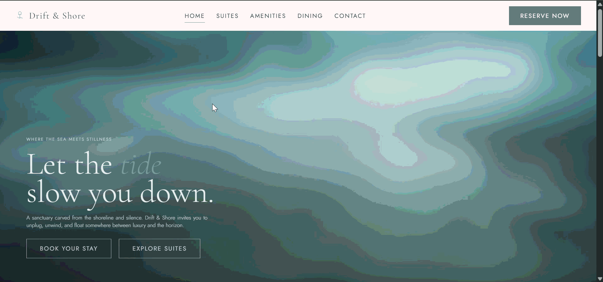
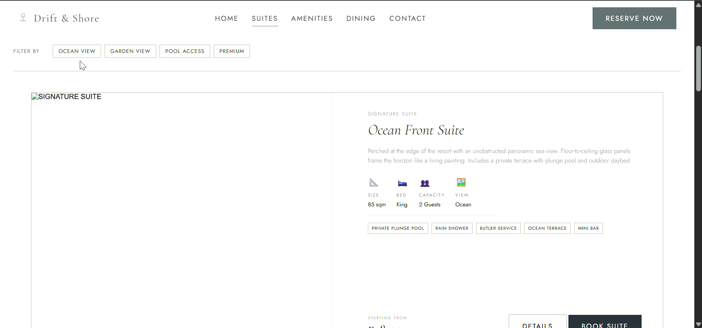
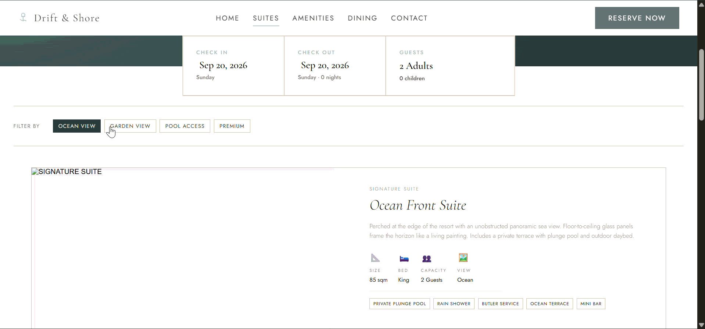
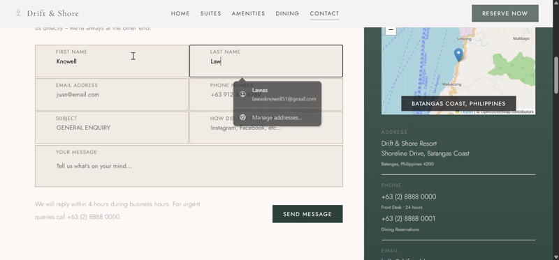

# Drift-N-Shore

Drift-N-Shore is a frontend website concept for a fictional resort enterprise, designed with a focus on immersive visuals, smooth interactions, and responsive presentation.

Originally created as a project for my Web Development class, I decided to take it further as an opportunity to explore **React** and modern frontend development techniques. Alongside the visual and animation work, I experimented with application features such as client-side routing, dynamic page rendering, room filtering, date selection, and map integration.

**Live Demo:** https://drift-n-shore.vercel.app/

## Features

* Responsive resort website and landing page
* Client-side routing for navigating between pages
* Dynamic room listings and room detail pages
* Tag-based room searching and filtering
* Calendar-based date selection
* Interactive location/map integration
* Smooth scrolling and scroll-based interactions
* Animated page elements and transitions
* Component-based UI built with React
* Responsive layouts for different screen sizes

<table>
  <tr>
    <td width="50%">
      
      <p align="center"><b>Home Page</b></p>
    </td>
    <td width="50%">
      
      <p align="center"><b>Dynamic rendering based on form input</b></p>
    </td>
  </tr>
  <tr>
    <td width="50%">
      
      <p align="center"><b>Tag-based room searching</b></p>
    </td>
    <td width="50%">
      
      <p align="center"><b>Map integration into Contact page</b></p>
    </td>
  </tr>
</table>

## Tech Stack

* **React** — UI development, routing, and component architecture
* **JavaScript** — Application logic and interactivity
* **CSS** — Styling and responsive layouts
* **GSAP** — Animations and motion effects
* **Lenis** — Smooth scrolling
* **Vercel** — Deployment

## What I Practiced

This project served as a hands-on exercise in building a more complete frontend application rather than a purely static website.

### React & Application Structure

* Building reusable and composable React components
* Managing application state and user interactions
* Organizing a multi-page experience within a single frontend application
* Implementing client-side routing and dynamic routes

### Dynamic Content

* Rendering room information dynamically 
* Filtering rooms using tags and search criteria
* Creating reusable layouts for different room details
* Connecting user input to dynamically rendered content

### User Interaction

* Implementing a calendar/date selector
* Handling interactive filtering and navigation
* Integrating an interactive map for resort location information
* Creating smooth transitions and scroll-based animations

### Visual Development

A significant part of the project was experimenting with how animation and motion could enhance the overall presentation. I used **GSAP** for animations and **Lenis** for smooth scrolling, with the goal of making the website feel more fluid and immersive without letting the animations get in the way of navigation.

## Getting Started

### Prerequisites

Make sure you have [Node.js](https://nodejs.org/) and npm installed.

### Installation

Clone the repository:

```bash
git clone https://github.com/three-onefouronefive/drift-n-shore.git
```

Navigate into the project directory:

```bash
cd drift-n-shore
```

Install the dependencies:

```bash
npm install
```

Start the development server:

```bash
npm run dev
```

The project should then be available at the local address provided by the development server.

## Project Status

Drift-N-Shore is primarily a learning and portfolio project. While it began as a Web Development class requirement, its scope expanded as I explored additional frontend technologies and interaction patterns.

The project may continue to receive improvements as I further explore React, animation, responsive design, and frontend application development.

## Credits

Built by Knowell M. Lawas as part of CSIT201.

Deployed with [Vercel](https://vercel.com/).
